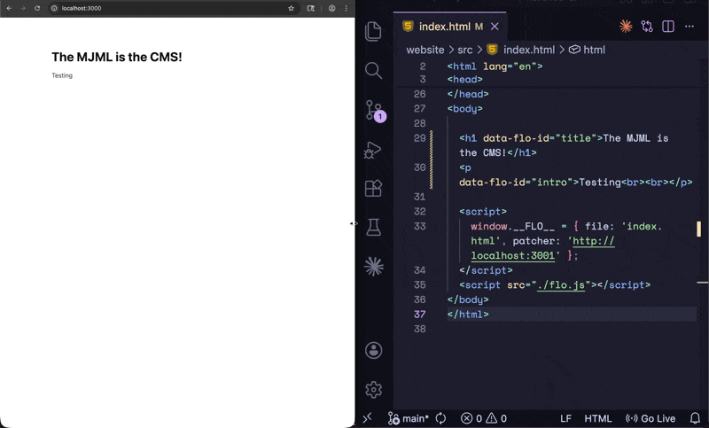

# Florence

> **Experimental.**

Bidirectional editing for HTML. Edit the rendered output of a webpage and the source file updates in real time.



No CMS. No build step. No framework. Just HTML.

---

## Quickstart

Requires [Rust](https://rustup.rs) and [Bun](https://bun.sh).

```bash
# 1. clone
git clone https://github.com/your-username/florence-ai.git
cd florence-ai

# 2. build the patcher
cd server && cargo build --release
```

Then in two terminals:

```bash
# terminal 1 — patcher
./server/target/release/florence --port 3001 --root ./website/src

# terminal 2 — dev server
bun ./website/src/index.html
```

Open the page in your browser, click any text, and edit it. Check `website/src/index.html` — the source updated.

---

## How it works

Add a `data-flo-id` attribute to any element you want to be editable:

```html
<h1 data-flo-id="title">Hello, world.</h1>
<p data-flo-id="intro">Edit me directly in the browser.</p>
```

Include `flo.js` and tell it where your patcher is running:

```html
<script>
  window.__FLO__ = { file: 'index.html', patcher: 'http://localhost:3001' };
</script>
<script src="./flo.js"></script>
```

Start the patcher, pointing at your source directory:

```bash
./florence --port 3001 --root ./website/src
```

Open the page in a browser. Click any annotated element, edit it, click away — the source file is updated.

---

## Editor controls

| Key | Action |
|-----|--------|
| `Enter` | New line |
| `Escape` | Revert changes |
| `Ctrl/Cmd+S` | Save immediately |
| `Ctrl/Cmd+B` | Bold |
| `Ctrl/Cmd+I` | Italic |
| `Ctrl/Cmd+U` | Underline |

Changes save on blur (when you click away from the element).

---

## Running from source

Requires [Rust](https://rustup.rs).

```bash
cd server
cargo build --release
```

Binary output: `server/target/release/florence`

```
USAGE:
    florence [OPTIONS]

OPTIONS:
    -p, --port <PORT>    Port to listen on [default: 3001]
    -r, --root <ROOT>    Root directory containing source files [default: ./website/src]
```

---

## Project structure

```
florence-ai/
  server/          Rust patcher binary
    src/main.rs
    Cargo.toml
  website/
    src/
      index.html   Your HTML source files live here
      flo.js       Browser client (include in your HTML)
```

---

## Design

Florence is intentionally minimal. The patcher does one thing: accept a `POST /patch` request and rewrite the matching element in the source file.

```json
{ "file": "index.html", "id": "title", "content": "New text" }
```

The source file is patched in-place using [lol_html](https://github.com/cloudflare/lol-html) — a streaming HTML rewriter that preserves your formatting and everything outside the edited element exactly as it was.

The browser client (`flo.js`) and the file server are intentionally decoupled. Serve your `website/src` however you like — `npx serve`, Caddy, Nginx, anything.

---

## License

MIT
